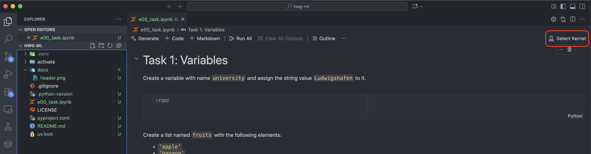
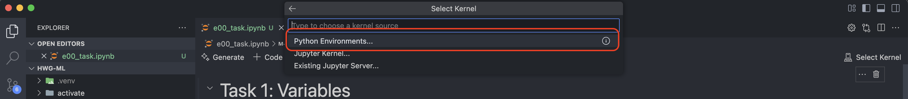
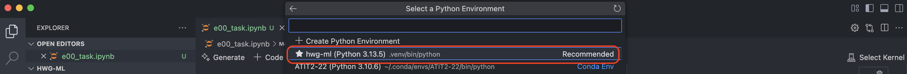
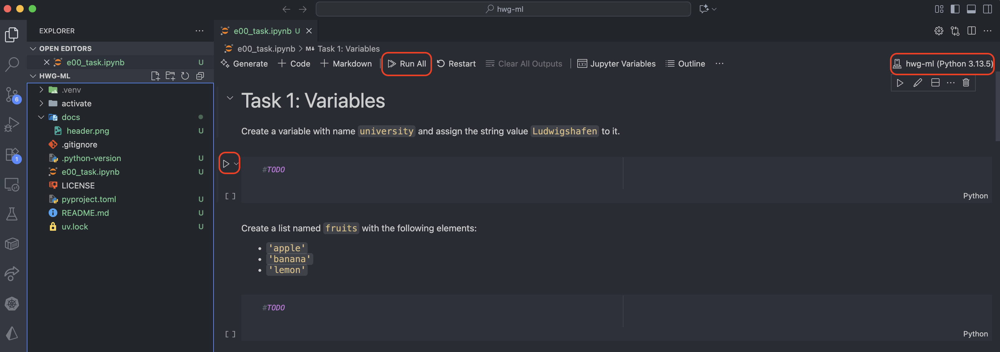

# C29332 Machine Learning


Welcome to the C29332 Machine Learning repository! This project is aimed to assist you in working on the exercises. 

## Prerequisites

You will need to work with your terminal to get these tools installed.

### Git

Make sure you have [Git](https://git-scm.com/) installed on your machine. You can download it from the official website and follow the installation instructions for your operating system using the [official guide](https://git-scm.com/book/en/v2/Getting-Started-Installing-Git).

### Visual Studio Code

This guided repo assumes that you are working with [Visual Studio Code](https://code.visualstudio.com/). If you haven't installed it yet, please download and install it from the official website. It will also work with other IDEs, but I can only provide support for VS Code.

### UV

We will be using [UV](https://docs.astral.sh/uv/) to manage our Python environment. Please download and install it on your device using the official [installation guide](https://docs.astral.sh/uv/getting-started/installation/).


## Cloning the Repository

Clone the repository to your local machine using the following command:

```bash
git clone https://github.com/ItsZiroy/hwg-ml.git
```
Navigate into the cloned directory:

```bash
cd hwg-ml
```

## Setting Up the Environment
Create a new Python environment using UV:

```bash
uv sync
```
This will create a virtual environment and install all the necessary dependencies specified in the `pyproject.toml` file.

## Working on the Exercises
I recommend you copy the unziped folder with the exercise into the `exercises` folder in the repository. This way, you can keep all your work organized in one place.

You will find all exercises on the [course page](https://h4hn.de/courses/c29331-machine-learning).

## Opening Jupyter Notebooks in VS Code

1. Open Visual Studio Code.
2. Install the Python extension for VS Code if you haven't already. You can find it in the Extensions view, search for "Python", and install the one published by Microsoft.
3. Open the cloned repository folder in VS Code by selecting `File > Open Folder` and navigating to the `hwg-ml` directory.
4. Copy over the exercise files and open the (`.ipynb`) in the repository.

### Selecting the Python Interpreter

1. On the Top Right Corner of the VS Code window, click on the Python kernel selector. 
2. Click on "Python Environment" 
3. Select the interpreter that corresponds to the UV environment you created earlier. It should be located in the `.venv/bin/python` folder inside the project directory. 

### Running the Notebooks

You can now run the cells in the Jupyter Notebook by clicking the "Run" button or using the keyboard shortcut `Shift + Enter`.


   
## Turning Off Copilot

If you have GitHub Copilot enabled in VS Code, I recommend you turn it off. Ultimately it is you decision, but if you leave it on, you will not actually learn anything.

1. Open the Command Palette by pressing `Ctrl + Shift + P` (or `Cmd + Shift + P` on macOS).
2. Type "Copilot: Disable Completions" and select the option to disable GitHub Copilot

You may re-enable it later by following the same steps and selecting "Copilot: Enable Completions".


